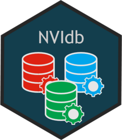

# NVIdb: Tools to facilitate the use of NVI’s databases 

<!-- README.md is generated from README.Rmd. Please edit that file -->

-   [Overview](#overview)
-   [Installation](#installation)
-   [Usage](#usage)
-   [Copyright and license](#copyright-and-license)
-   [Contributing](#contributing)

## Overview

`NVIdb`provides tools to facilitate downloading and processing of data
from the Norwegian Veterinary Institute’s databases, in particular PJS
and EOS. The package comprises several categories of functions: 1)
Manage credentials (i.e. password and username), 2) Login functions for
database services, 3) Select PJS-data, 4) Initial cleaning of PJS-data,
5) Read, copy and update various in-house data registers, 6) Translate
codes into descriptions. NVIdb is dependant of NVIconfig which has to be
installed manually from GitHub.

`NVIdb` is part of `NVIverse`, a collection of R-packages with tools to
facilitate data management and data reporting at the Norwegian
Veterinary Institute (NVI). The `NVIverse` consists of the following
packages: `NVIconfig`, `NVIdb`, `NVIspatial`, `NVIpretty`, `NVIbatch`,
`OKplan`, `OKcheck`, `NVIcheckmate`, `NVIpackager`, `NVIrpackages`. See
[Contribute to
NVIdb](https://github.com/NorwegianVeterinaryInstitute/NVIdb/blob/main/CONTRIBUTING.md)
for more information.

## Installation

`NVIdb` is available at
[GitHub](https://github.com/NorwegianVeterinaryInstitute). To install
`NVIdb` you will need:

-   R version > 4.0.0
-   R package `remotes`
-   Rtools 4.0 or Rtools 4.2 depending on R version

First install and attach the `remotes` package.

    install.packages("remotes")
    library(remotes)

To install (or update) the `NVIdb` package, run the following code:

    remotes::install_github("NorwegianVeterinaryInstitute/NVIdb",
        upgrade = FALSE,
        build = TRUE,
        build_vignettes = TRUE)

In addition, you will also need to install the private package
`NVIconfig` that keep specific information on NVI’s paths and databases.
`NVIconfig` is expected to be relatively stable and you will not need to
update `NVIconfig` every time `NVIdb` is updated.

To install (or update) the `NVIconfig` package, run the following code:

    remotes::install_github("NorwegianVeterinaryInstitute/NVIconfig",
        auth_token = "PAT",
        upgrade = FALSE,
        build = TRUE,
        build_vignettes = TRUE)

where PAT is your personal access token.

## Usage

The `NVIdb` package needs to be attached.

    library(NVIdb)

`NVIdb` provides tools to facilitate downloading and processing of data
from the Norwegian Veterinary Institute’s databases, in particular PJS
and EOS. The package comprises several categories of functions:

1.  Manage credentials (i.e. password and username),
2.  Login functions for database services,
3.  Select PJS-data,
4.  Initial cleaning of PJS-data,
5.  Read, copy and update various in-house data registers,
6.  Translate codes into descriptions.

By combining the functions for managing username and password and the
login functions, you are able to login to PJS and EOS (and potentially
other databases) without hard coding the password in the script.
Thereafter, you may extract data from PJS and EOS using the R-package
`RODBC`.

The read copy and update functions for data from NVI’s internal
databases gives you access to these data without any need of knowing
where the data are stored. Currently you get access to registers of
administrative regions (Kommune, Fylke, Postnummer, Mattilsynets
avdelinger og regioner), produsentinformasjon
(Produksjonstilskuddsregister and new and old prodnr) and translation
tables for PJS-codes into descriptive text.

There are also functions to use these registers to translate variables
with codes into names and others. You can translate

-   PJS-codes into descriptive text,
-   kommunenr into kommune, fylke, as well as current kommunenr,
    kommune, fylkenr and fylke
-   kommunenr into Mattilsynets avdeling and region
-   postnr into poststed and poststedets kommunenr
-   old produsentnr into current produsentnr

The full list of all available functions and datasets can be accessed by
typing

    help(package = "NVIdb")

Please check the NEWS for information on new features, bug fixes and
other changes.

## Copyright and license

Copyright (c) 2019 - 2022 Norwegian Veterinary Institute.  
Licensed under the BSD\_3\_clause License. See
[License](https://github.com/NorwegianVeterinaryInstitute/NVIdb/blob/main/LICENSE)
for details.

## Contributing

Contributions to develop `NVIdb` is highly appreciated. There are
several ways you can contribute to this project: ask a question, propose
an idea, report a bug, improve the documentation, or contribute code.
See [Contribute to
NVIdb](https://github.com/NorwegianVeterinaryInstitute/NVIdb/blob/main/CONTRIBUTING.md)
for more information.

## <!-- Code of conduct -->

Please note that the NVIdb project is released with a [Contributor Code
of
Conduct](https://github.com/NorwegianVeterinaryInstitute/NVIdb/blob/main/CODE_OF_CONDUCT.md).
By contributing to this project, you agree to abide by its terms.
